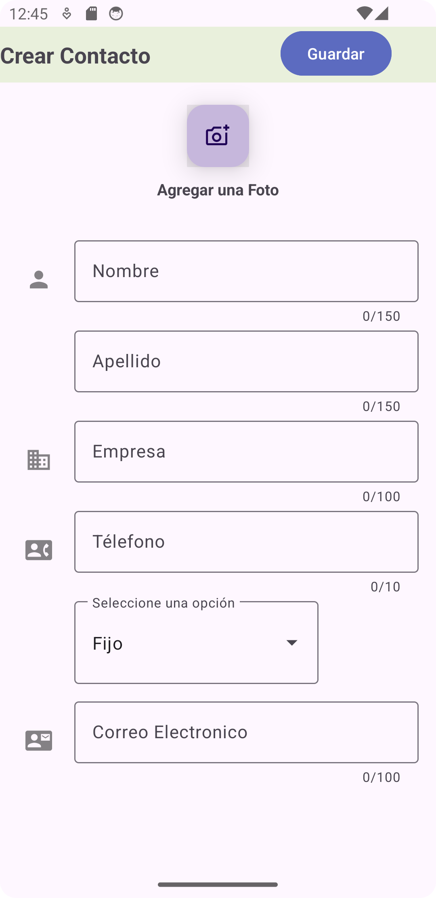
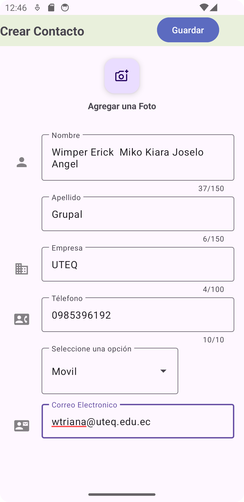

# Tarea Grupal "DESARROLLAR UNA APLICACIÓN MÓVIL ANDROID CON EL USO DE LOS CONTROLES COMUNES DE LA INTERFAZ DE USUARIO (UI) DE ANDROID"
## Integrantes: 
Erick Moran Garcez  
Wimper Josue Triana  
Kiara Intriago  
Jose Lopez  
Cristhian Ortega

---------- 
----------

---------- 
----------

---------- 
----------

---------- 
----------

---------- 

---------- 
----------
----------
